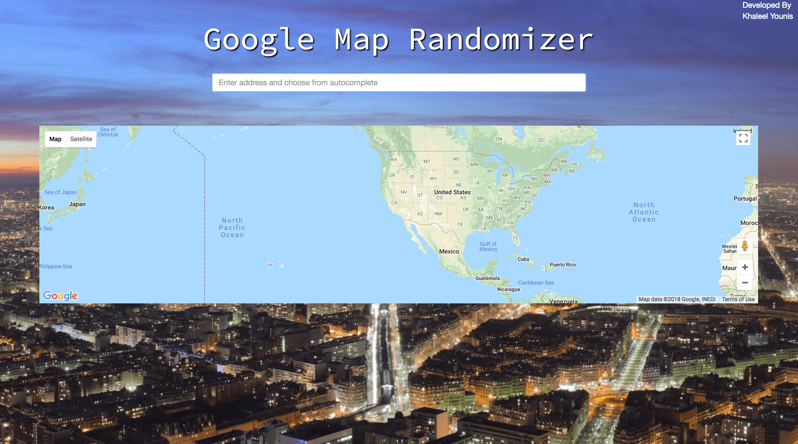
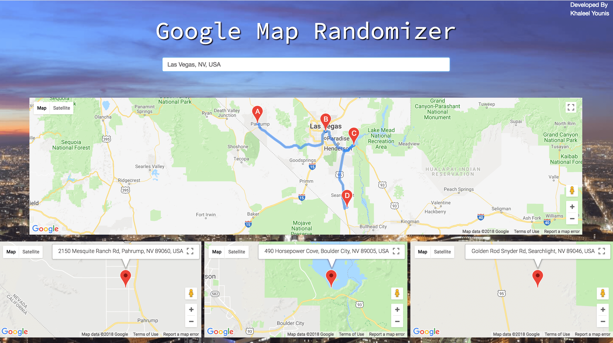
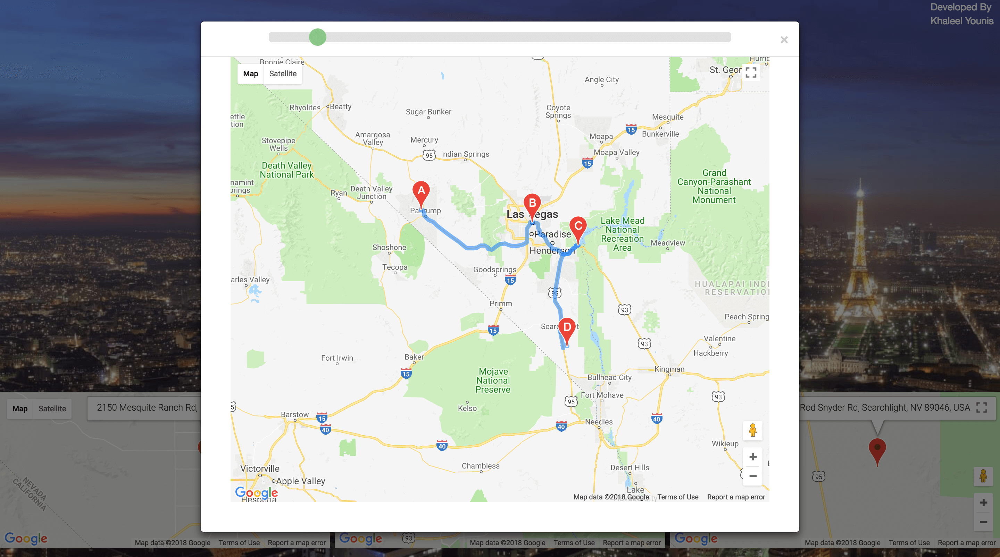
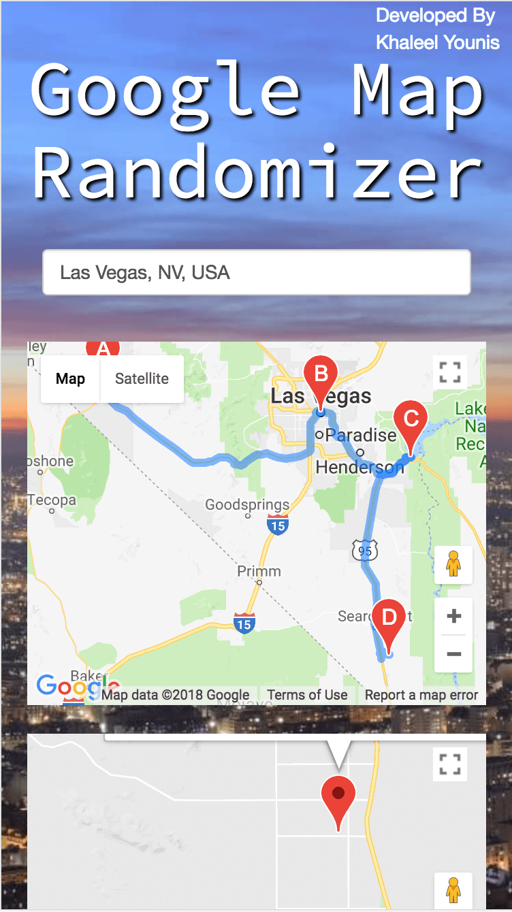

# Google Map Randomizer

An application build around Google Maps API, that allows you to autocomplete a location and find 3 seperate locations 50-70 miles way from your target. 

 | 
:-------------------------:|:-------------------------:

 | 
:-------------------------:|:-------------------------:

## Technologies Used

* JavaScript
* jQuery
* HTML5
* CSS3
* Bootstrap3
* Google Maps JavaScript API
* Google Maps Geocoder API
* Google Maps Places API
* Google Maps Directions API

## Tools Used

* Git
* GitHub

## Authors

* Khaleel Younis [GitHub](https://github.com/stallenvp) | [Portfolio](https://khaleelyounis.com/)
